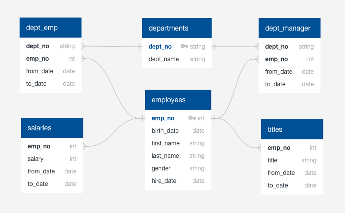

# Unit 9 | SQL Solution

## Description:

Solution for the assignment defined at: https://github.com/the-Coding-Boot-Camp-at-UT/UTAMCB201904DATA3/tree/master/09-SQL/Homework/Instructions

### To execute the solution

1. Create a database in Postgress

2. Execute the commands defined at schema.sql

3. Execute the queries defined at queries.sql the file has comments per each analysis requested

4. Update BonusSQL.ipynb with the Postgres informayion related to your data base and execute

5. Execute the 

### The data base implemented in this solution looks like this:

