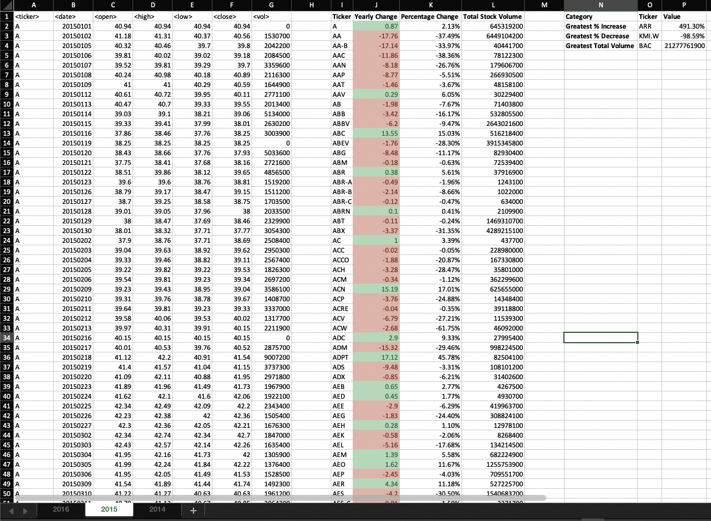
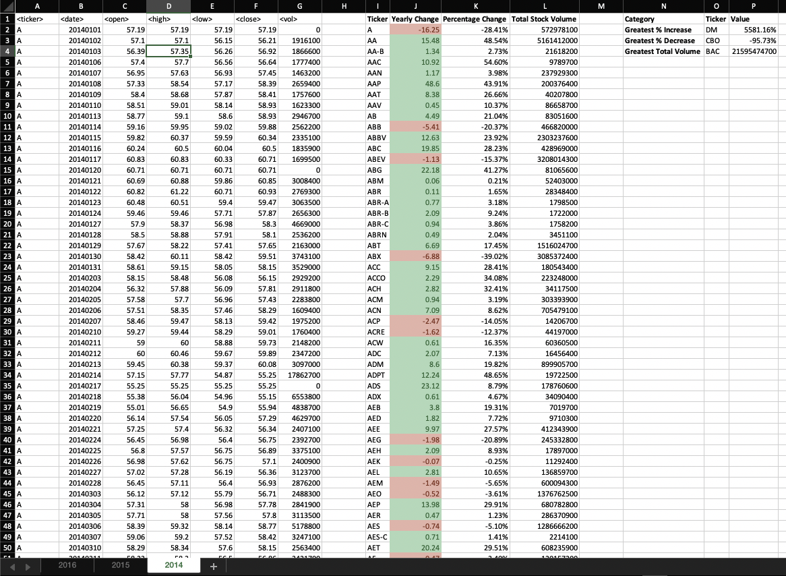

# Unit 2 | Solution - The VBA of Wall Street

## Description:

Solution for the assignment defined at:  https://github.com/the-Coding-Boot-Camp-at-UT/UTAMCB201904DATA3/tree/master/02-VBA-Scripting/Homework/Instructions 

### Files

* [Solution Macro-Enabled](Multiple_year_stock_data.xlsm) - Used to store the spreadsheet with the solution macro enabled.

* [Solution Macro-disabled](Multiple_year_stock_data.xlsx) - Used to store the spreadsheet without the macro.

* [Solution VBA](solution.vbs) - VBA script for the solution.

### Results

